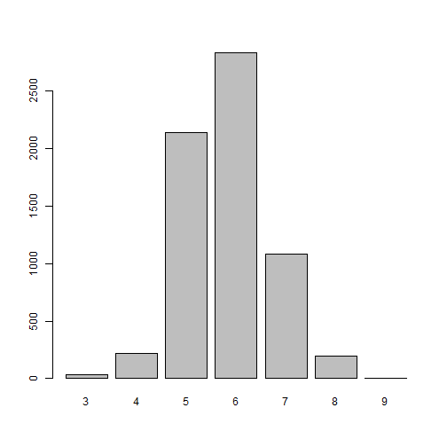

DEVELOPING DATA PRODUCTS
========================================================
author: Vivek Kumar Sah
date: March 30, 2021
autosize: true 


OVERVIEW
========================================================

<font = "5"> Nothing feels as satisfying and authentic as making your first batch of wine. And there's no better time to try it than in early autumn, when grapes all over the country are ripening in vineyards and backyard gardens. Whatever kind of grapes you use, the general techniques, equipment and ingredients are the same. This app is designed to evaluate the wine you plan to develop.

You may access my Shinyapp page at https://vivek-sah.shinyapps.io/project and and start making the wine recipe of your life. Source code for ui.R and server.R  files are available on the GitHub https://github.com/vivek-sah/shiny-application-and-reproducible-pitch </font>


APP FUNCTIONALITY
========================================================
<font size = "5">The purpose of this app is to guide you in evaluating the quality of your wine based on how the ingredients are adjusted. The dataset is sourced from UCI Machine Learning Repository (Wine Quality Dataset). Red Wine and White Wine files were merged into 1 data set called wine. Below are the ingredients used to make a wine. </font>

```r
head(wine,1)
```

```
  fixed.acidity volatile.acidity citric.acid residual.sugar chlorides
1           7.4              0.7           0            1.9     0.076
  free.sulfur.dioxide total.sulfur.dioxide density   pH sulphates alcohol
1                  11                   34  0.9978 3.51      0.56     9.4
  quality color
1       5   red
```


DATASET
========================================================
<font size = "5">Looking at the data distribution of data from the combined red and white wines, we can plot the wine quality using barplot. Quality of wine is mesured based on the quality number stated on the x-axis. The higher the number, the higher the quality. The two datasets are related to red and white variants of the Portuguese "Vinho Verde" wine.</font>


ASSUMPTION
========================================================
<font size = "5">As per dataset information, there are more normal wines than excellent or poor ones so we can  assume that the normal one is quality number 6. We further classify this and added a column "taste" on the dataset to describe the quality number into a meaningful information. This column is used by the app to predict the quality of wine ranging from very poor to very excellent  and will vary based on the entered values.</font>

```r
wine$taste[wine$quality <= 3] <- 'very poor'
wine$taste[wine$quality == 4] <- 'poor'
wine$taste[wine$quality == 5] <- 'average'
wine$taste[wine$quality == 6] <- 'average'
wine$taste[wine$quality == 7] <- 'above average'
wine$taste[wine$quality == 8] <- 'excellent'
wine$taste[wine$quality >= 9] <- 'very excellent'
```
